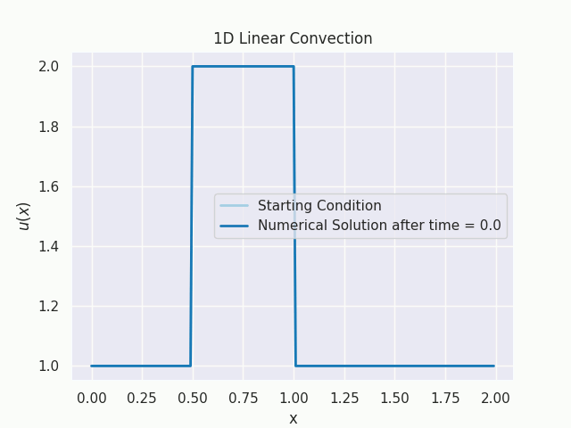
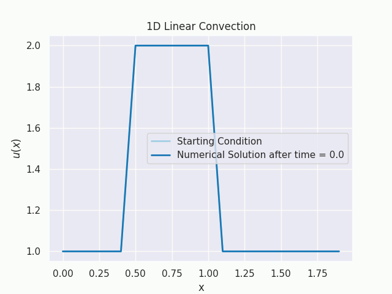
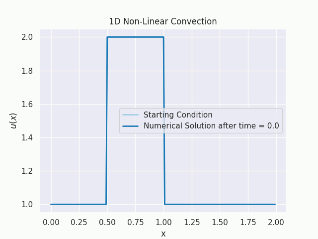
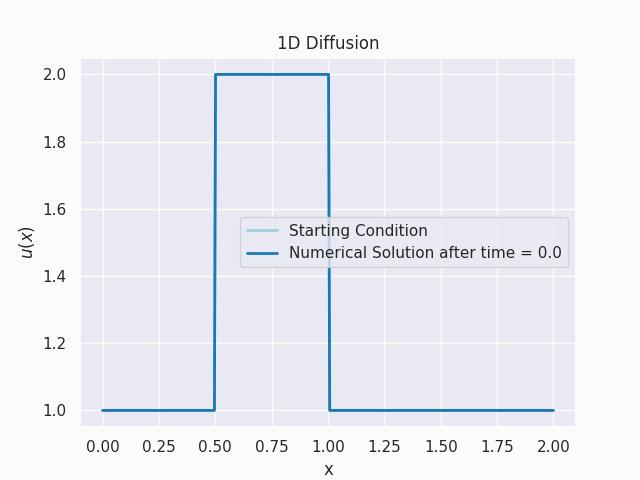
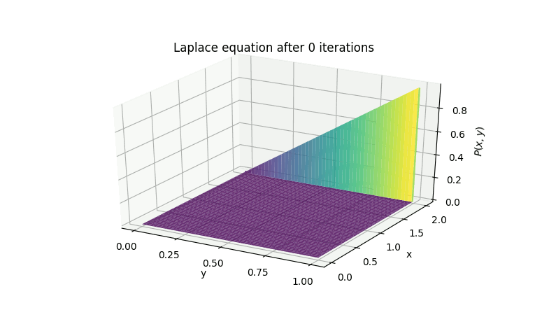
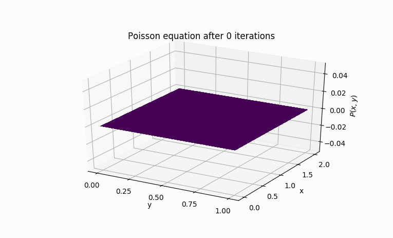

# Computational Fluid Dynamics

My code for the Computational Fluid Dynamics course by Prof. Lorena A. Barba, from Boston University

Check out the course: https://www.youtube.com/watch?v=cDy5XGOokBY&list=PL30F4C5ABCE62CB61&index=1

## Assigment #1: 1D Linear Convection
**Discretization scheme:**
1. Forward difference for the time derivative.
2. Backward difference for the space derivative.

### When the consistency condition is not satisfied, in this case: the CFL number is greater than or equal to 0 and less than or equal to 1, our solution will diverge.

## Assignment #2: 1D Non-linear Convection
**Discretization scheme:**
1. Forward difference in time.
2. Backward difference in space.

## Assignment #3: 1D Diffusion
**Discretization scheme:**
1. Forward difference in time.
2. Central difference in space. (Since space is isotropic).

### When the Von Neumann stability condition is not met, in this case: CFL number is less than or equal to 0.5, the solution diverges. (Will write more on this later).

## Assignment #4: 1D Burgers' Equation

## Assignment #5: 2D Linear Convection
**Discretization scheme:**
1. Forward difference for the time derivative.
2. Backward difference for the space derivatives.

## Assignment #6: 2D Convection

## Assignment #7: 2D Diffusion

## Assignment #8: 2D Diffusion

## Assignment #9: Laplace Equation

## Assignment #10: Poisson Equation

## Assignment #11: Cavity Flow with Navier-Stokes

## Assignment #12: Channel Flow with Navier-Stokes

